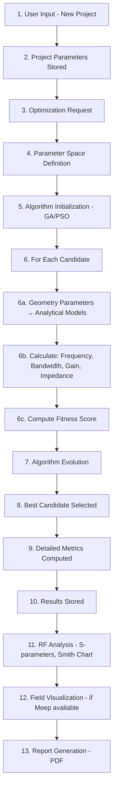

# ANTEX – AI-Powered Antenna Design & Optimization Platform

ANTEX (Antenna Design & Simulation Platform) is an industry-grade antenna design and optimization system that combines analytical electromagnetic models, FDTD simulations, and AI-powered optimization algorithms to design and analyze microstrip patch antennas. It uses Genetic Algorithms (GA) and Particle Swarm Optimization (PSO) to find optimal antenna geometries.

## Features

- **Multiple antenna shapes:** Rectangular patch, star patch, meandered line, ring patch  
- **Optimization algorithms:** GA and PSO with configurable parameters  
- **Simulation modes:** Fast analytical models and optional Meep FDTD for higher accuracy  
- **RF analysis:** Smith Chart, VSWR, return loss, L-section impedance matching  
- **Visualization:** 2D geometry, convergence plots, performance metrics  
- **Report generation:** Comprehensive PDF reports with AI recommendations  

## Design Workflow Flowchart

The ANTEX design workflow follows these steps:



## Screenshots from Report

### Dashboard
Project management and optimization overview.


### Performance Metrics
Real-time visualization of frequency, bandwidth, gain, and VSWR.


### AI Recommendations
Impedance matching suggestions and design improvements.


## Quick Start

### Prerequisites
- Docker & Docker Compose  
- (Optional) Python 3.10+, Node.js 18+ for local development  

### Run with Docker

```bash
docker-compose up -d
```

Then open http://localhost:5173 for the frontend.

### Local Development

**Backend:**
```bash
cd backend
pip install -r requirements.txt
# Configure PostgreSQL and run
uvicorn api.main:app --reload
```

**Frontend:**
```bash
cd frontend
npm install
npm run dev
```

## Project Structure

| Component | Location |
|-----------|----------|
| Backend API | `backend/api/` |
| Simulation & Models | `backend/sim/` |
| Optimization (GA/PSO) | `backend/optim/` |
| Frontend | `frontend/src/` |
| Technical Report | `TECHNICAL_REPORT.md` |
| IEEE Paper | `Report/ANTEX_Paper.tex` |

## Documentation

- **[TECHNICAL_REPORT.md](TECHNICAL_REPORT.md)** – Full technical documentation, formulas, and architecture  
- **[FEATURES.md](FEATURES.md)** – Feature list and status  
- **[Report/ANTEX_Paper.pdf](Report/ANTEX_Paper.pdf)** – IEEE conference paper  

## License

MIT

